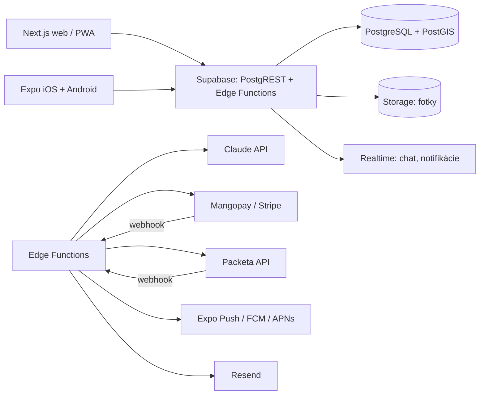

# Tržko – technické riešenie

Návrh architektúry pre inzertný portál SK + CZ, ktorý beží ako web aj ako mobilná aplikácia.
Nadväzuje na klikateľný prototyp v `prototyp/trzko.html`. Databázová schéma je v `db/schema.sql`.

## 1. Zásady

1. **Jeden backend, dve klientske vrstvy.** Web (SEO, Google je hlavný zdroj návštev) a natívne aplikácie zdieľajú rovnaké API a rovnakú databázu.
2. **Zadarmo pre inzerentov, zárobok na doplnkoch.** Topovanie, bezpečná platba, doručenie, balíky pre firmy.
3. **Bezpečnosť ako produkt.** Overenie, úschova platby, chat bez čísla, detekcia podvodov. Toto sú hlavné rozdiely oproti Bazošu, takže musia byť v jadre, nie dolepené.
4. **Malý tím, hotové služby.** Nepísať vlastný auth, platby, úložisko ani push notifikácie. Kupovať ako službu, písať len to, čo je jedinečné.
5. **EÚ dáta.** Všetko hostovať v EÚ (Frankfurt), kvôli GDPR a latencii.

## 2. Odporúčaný stack

| Vrstva | Voľba | Prečo |
|---|---|---|
| Web | **Next.js** (React, TypeScript), hostovaný na Vercel, EÚ región | Server-side rendering pre SEO každého inzerátu a kategórie. PWA režim umožní „pridať na plochu“ ešte pred natívnymi aplikáciami. |
| Mobilné aplikácie | **Expo (React Native)** s Expo Router | Jeden kód pre iOS a Android, zdieľanie TypeScript typov a API klienta s webom. Push notifikácie cez Expo Push. |
| Backend a databáza | **Supabase** (PostgreSQL 16 + PostGIS, Auth, Storage, Realtime, Edge Functions) | Hotové prihlasovanie (telefón, e-mail, Google, Apple), riadenie prístupu priamo v databáze (RLS), realtime chat bez vlastného websocket servera. |
| Vyhľadávanie | PostgreSQL full-text (`unaccent` + `pg_trgm`) v prvej fáze, **Meilisearch** keď presiahne ~500 000 inzerátov | SK a CZ diakritika, preklepy, rýchle fazety. |
| Obrázky | Supabase Storage + transformácie (resize, WebP), neskôr Cloudflare Images | Automatické zmenšenie, odstránenie EXIF (GPS poloha z fotky!). |
| Platby s úschovou | **Mangopay** (marketplace escrow, licencovaná platobná inštitúcia v EÚ) alebo **Stripe Connect** s odloženým prevodom | Peniaze drží licencovaný partner, nie ty. Vlastné držanie cudzích peňazí vyžaduje licenciu NBS / ČNB. |
| Doručenie | **Packeta / Zásielkovňa API** (SK aj CZ, výdajné boxy) | Štítok sa vygeneruje priamo z inzerátu po zaplatení. |
| Overenie identity | SMS kód (Supabase Auth + Twilio), bankový prevod 1 cent s menom, neskôr **Bank iD** (CZ) a doklad cez Veriff | Stupňovité: každý stupeň pridá odznak a limity. |
| Umelá inteligencia | **Claude API**, model `claude-opus-5-5` (vstup 4 $/M tokenov, výstup 20 $/M) | Z fotky navrhne názov, kategóriu, stav, popis a cenu. Klasifikácia správ na podvody. Jeden inzerát z fotky stojí rádovo 0,01 až 0,02 €. |
| E-maily | Resend alebo Postmark | Transakčné maily, notifikácie z uložených hľadaní. |
| Monitoring | Sentry (chyby), Plausible (návštevnosť bez cookie lišty), Supabase logy | |

Alternatíva pre menšie náklady na začiatku: namiesto Vercel vlastný VPS (Hetzner, Falkenstein) s Dockerom. Supabase sa dá tiež hostovať sám, ale v prvom roku sa to neoplatí.

## 3. Architektúra



Klienti čítajú väčšinu dát priamo cez Supabase (PostgREST + RLS). Všetko, čo potrebuje tajné kľúče alebo viac krokov, ide cez Edge Functions:

- `listing-draft-from-photos` – zavolá Claude API, vráti predvyplnený inzerát.
- `order-create`, `order-release`, `order-refund` – práca s platobným partnerom.
- `shipment-create` – vytvorí zásielku a štítok cez Packeta.
- `message-screen` – ohodnotí novú správu, označí podozrivú.
- `payment-webhook`, `shipment-webhook` – spracujú udalosti od partnerov.
- `saved-search-notify` – cron každých 15 minút, pošle notifikácie na nové inzeráty.
- `listing-expire` – cron denne, archivuje inzeráty staršie než 60 dní bez obnovenia.

## 4. Dátový model (prehľad)

Podrobne v `db/schema.sql`. Hlavné tabuľky:

| Tabuľka | Obsah |
|---|---|
| `profiles` | Používateľ (naväzuje na `auth.users`), krajina, jazyk, hodnotenie, stupeň overenia, firemný profil. |
| `verifications` | Záznam každého overenia: telefón, e-mail, banka, doklad. |
| `categories` | Strom kategórií, slug pre SK aj CZ, vlastné atribúty podľa kategórie (napr. rok výroby pri autách). |
| `listings` | Inzerát: názov, popis, cena, mena, stav, poloha (PostGIS bod + názov obce), doručenie, bezpečná platba, stav životného cyklu, full-text vektor. |
| `listing_images` | Fotky s poradím, rozmermi a hashom (detekcia duplicít). |
| `listing_attributes` | Hodnoty atribútov podľa kategórie (kľúč, hodnota). |
| `favorites`, `saved_searches` | Uložené inzeráty a hľadania s notifikáciami. |
| `conversations`, `messages` | Chat viazaný na inzerát, správa s výsledkom kontroly na podvod. |
| `orders`, `order_events` | Bezpečná platba: stav od vytvorenia cez zaplatenie, odoslanie, prevzatie až po uvoľnenie alebo vrátenie. |
| `shipments` | Zásielka cez Packeta, sledovacie číslo, výdajné miesto. |
| `reviews` | Hodnotenie po dokončenej objednávke, jedno na objednávku a stranu. |
| `reports`, `moderation_actions` | Nahlásenia a zásahy moderátora. |
| `promotions` | Platené doplnky (topovanie, zvýraznenie) s platnosťou. |
| `notifications`, `push_tokens` | Notifikácie v aplikácii a tokeny zariadení. |

Kľúčové rozhodnutia:

- **Poloha** je PostGIS bod (`geography`) plus textový názov obce a kód okresu. Vzdialenosť sa počíta v databáze, index GiST umožní „do 30 km“ rýchlo.
- **Mena** sa ukladá pri inzeráte (EUR alebo CZK) v najmenších jednotkách (centy, haliere). Prepočet robí klient podľa denného kurzu v tabuľke `exchange_rates`.
- **Telefónne číslo** nie je nikdy v tabuľke inzerátu. Je v `profiles` s RLS, ktoré ho vráti len samotnému používateľovi. Odkrytie čísla ide cez funkciu, ktorá zaloguje, kto a kedy si ho pozrel (brzda proti vyťahovaniu čísel).
- **Stavový automat objednávky** je vynútený triggerom, aby sa nedal preskočiť krok (napr. uvoľniť peniaze bez prevzatia).

## 5. Bezpečnosť a ochrana pred podvodmi

1. **RLS na každej tabuľke.** Verejné sú len aktívne inzeráty, verejné časti profilu a kategórie. Správy vidia len obaja účastníci. Objednávky len kupujúci, predajca a moderátor.
2. **Stupne overenia a limity.** Neoverený účet: 3 aktívne inzeráty, bez bezpečnej platby. Telefón: 20 inzerátov. Banka: bez limitu, výplaty. Firma: hromadný import.
3. **Kontrola správ.** Každá správa prejde pravidlami (odkaz mimo domény, slová „kuriér“, „som v zahraničí“, výzvy na platbu mimo aplikácie). Podozrivé idú na klasifikáciu do Claude API a dostanú skóre. Nad prahom sa zobrazí varovanie ako v prototype a správa ide do fronty moderátora.
4. **Kontrola inzerátov.** Hash fotiek proti známym podvodným fotkám, cena výrazne pod trhom v kategórii, nový účet s drahou elektronikou. Takéto inzeráty čakajú na schválenie.
5. **Odkrytie čísla** je logované a obmedzené na 10 za deň pre bežný účet.
6. **EXIF sa odstraňuje** pri nahraní, inak fotka prezradí presnú adresu predajcu.
7. **Zákon o digitálnych službách (DSA).** Potrebné: jednoduché nahlásenie, odpoveď nahlasovateľovi, možnosť odvolania, kontaktný bod. Tabuľky `reports` a `moderation_actions` sú na to pripravené.
8. **GDPR.** Export a zmazanie účtu ako funkcia, mazanie správ 2 roky po poslednej aktivite, anonymizácia hodnotení.

## 6. Bezpečná platba, krok za krokom

1. Kupujúci klikne „Kúpiť bezpečne“, vyberie výdajný box. Vznikne `order` v stave `created`.
2. Platobný partner vytvorí platbu, kupujúci zaplatí kartou alebo prevodom. Webhook prepne stav na `paid`. Peniaze sú na účte partnera, nie u teba ani u predajcu.
3. Predajca dostane štítok Packeta, odnesie balík do boxu. Webhook od Packeta prepne na `shipped`, kupujúci dostane sledovanie.
4. Kupujúci balík prevezme. Stav `delivered`. Má 48 hodín na reklamáciu.
5. Bez reklamácie sa po 48 hodinách automaticky uvoľnia peniaze predajcovi (stav `released`), mínus provízia. Pri reklamácii stav `disputed`, rieši moderátor, výsledok `refunded` alebo `released`.

Provízia: 0 % pre predajcu, kupujúci platí službu 3 % + 0,50 € (minimum 1 €) plus dopravu. Pri cene 100 € zaplatí kupujúci 103,50 € + doprava, predajca dostane 100 €.

## 7. Funkcia „inzerát z fotky“

Edge Function pošle do Claude API 1 až 4 fotky a krátky kontext (krajina, jazyk, strom kategórií). Vyžiada štruktúrovanú odpoveď v pevnom formáte:

```json
{
  "title": "Horský bicykel Kross Level 5.0, rám L, 29\"",
  "category_slug": "sport/bicykle/horske",
  "condition": "used",
  "description": "…",
  "attributes": { "frame_size": "L", "wheel_size": "29" },
  "price_suggestion": { "min": 38000, "max": 46000, "recommended": 42000, "currency": "EUR" },
  "confidence": 0.86
}
```

Odporúčanú cenu model nehádza od oka. Funkcia mu pošle aj 20 posledných predaných inzerátov z rovnakej kategórie s podobným názvom (z tabuľky `listings` so stavom `sold`), takže návrh vychádza z vlastných dát portálu. Kým vlastných dát nie je dosť, odhaduje sa z aktívnych inzerátov.

Používateľ vidí návrh ako predvyplnený formulár a všetko môže zmeniť. Odpoveď s `confidence` pod 0,5 sa zobrazí ako prázdny formulár s nápovedou.

## 8. Vyhľadávanie a notifikácie

- Full-text stĺpec `search_vector` kombinuje názov (váha A), popis (váha B) a názov kategórie (váha C), s konfiguráciou `simple` + `unaccent`, aby „kocik“ našlo „kočík“ aj „kočárek“.
- Fazety: kategória, cena, vzdialenosť, stav, doručenie, overený predajca, krajina.
- Uložené hľadanie je uložený filter. Cron každých 15 minút spustí dotaz pre hľadania so zapnutými notifikáciami, porovná s `last_checked_at` a pošle push alebo e-mail s počtom nových.
- Zníženie ceny uloženého inzerátu spustí notifikáciu každému, kto ho má v obľúbených.

## 9. SEO

- Každý inzerát má vlastnú URL `/sk/inzerat/{slug}-{id}` a `/cz/inzerat/{slug}-{id}` s `hreflang`.
- Kategórie a kombinácie kategória + mesto majú statické stránky s textom a počtom inzerátov (`/sk/bicykle/bratislava`).
- Štruktúrované dáta `Product` a `Offer` (JSON-LD) na detaile.
- Sitemap generovaná denne, archivované inzeráty vracajú 410 s odkazom na podobné.

## 10. Náklady (odhad, mesačne)

| Položka | Štart (do 10 000 inzerátov) | Rast (do 200 000 inzerátov) |
|---|---|---|
| Supabase Pro | 25 $ | 100 až 300 $ |
| Vercel Pro | 20 $ | 20 až 150 $ |
| Úložisko a prenos fotiek | 5 $ | 50 až 200 $ |
| SMS overenie | 20 € | 200 € |
| Claude API | 10 € | 150 € |
| E-maily | 0 € | 20 € |
| Platobný partner | podľa objemu (cca 1,8 % + 0,18 € za transakciu) | |
| Apple + Google vývojárske účty | 99 $/rok + 25 $ jednorazovo | |
| **Spolu** | **cca 100 € mesačne** | **cca 600 až 1 000 € mesačne** |

Vývoj je najväčší náklad. Minimálna verzia (web + PWA, bez natívnych aplikácií) je odhadom 10 až 14 týždňov práce jedného skúseného vývojára, natívne aplikácie ďalšie 6 až 8 týždňov.

## 11. Plán fáz

**Fáza 0 (2 týždne): základ.** Supabase projekt, schéma, auth cez telefón a e-mail, Next.js kostra, nahrávanie fotiek, zoznam a detail inzerátu. Nasadiť na doménu s jednou kategóriou a jedným regiónom.

**Fáza 1 (4 týždne): minimálny produkt.** Pridanie inzerátu s predvyplnením z fotky, vyhľadávanie s filtrami a vzdialenosťou, chat s realtime, obľúbené, uložené hľadania s notifikáciou, profil s overením telefónu, nahlasovanie. PWA manifest a push na webe.

**Fáza 2 (4 týždne): dôvera a peniaze.** Bezpečná platba cez partnera, Packeta, hodnotenia, stupne overenia, kontrola správ, topovanie. Firemné účty s importom cez CSV.

**Fáza 3 (6 až 8 týždňov): aplikácie.** Expo aplikácie pre iOS a Android s rovnakým API, natívne push, fotenie priamo z aplikácie, prihlásenie cez Apple a Google. Potom druhá krajina naplno (CZ platby v Kč, Bank iD).

**Fáza 4: rast.** Meilisearch, cenové mapy ako obsah pre SEO, API pre bazáre, Cloudflare Images, A/B testy.

## 12. Čo treba rozhodnúť pred začiatkom

1. Názov a doména (zoznam voľných je v predošlej analýze, odporúčané Tržko, Hupsni alebo Kupko).
2. Platobný partner: Mangopay má lepšiu podporu úschovy, Stripe jednoduchšiu integráciu. Treba si vyžiadať ponuky, oba vyžadujú firmu (s. r. o.) a overenie.
3. Prvá kategória a región pre štart.
4. Kto vyvíja: jeden vývojár na plný úväzok, alebo agentúra na základ a potom vlastný človek.
